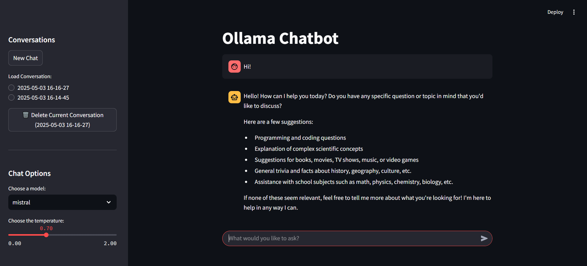

# Ollama Chatbot

A simple, interactive web interface for chatting with Ollama language models using Streamlit.

<center></center>


## Overview

This application provides a user-friendly web interface to interact with local LLMs through the Ollama API. It features:

- A clean chat interface.
- Model selection from available Ollama models.
- Temperature adjustment for response generation.
- Streaming responses for immediate feedback.
- Remembers previous messages within the current chat.
- Conversations are automatically saved locally to `chat_history.json`.
- Load previous conversations, start new ones, or delete old ones via the sidebar.


## Requirements

- Python 3.7+
- Streamlit
- Ollama

## Installation

1. Install Ollama and download a small model for testing (instructions for Linux systems below)
   - Visit [Ollama's website](https://ollama.ai/) for installation instructions for other systems
   ```bash
   # Install Ollama
   curl -fsSL https://ollama.com/install.sh | sh

   # Pull a small model for testing
   ollama pul gemma3:1b
   ```

2. Clone this repository.
   ```bash
   git clone https://github.com/rj-price/ollama_chatbot.git
   ```

3.  Set up a Python virtual environment.
    ```bash
    python -m venv venv
    source venv/bin/activate  # On Windows use `venv\Scripts\activate`
    ```

4.  Install the required Python packages.
    ```bash
    pip install -r requirements.txt
    ```

## Usage

1.  Navigate to the project directory in your terminal.

2.  Start the application:
    ```bash
    streamlit run chatbot.py
    ```

3.  Open your web browser and navigate to the URL displayed in your terminal (typically `http://localhost:8501`).

4.  Use the sidebar to:
    - Start a `New Chat`.
    - `Load Conversation`: Select a previously saved chat from the list (sorted by most recent). The current chat (if any) will be saved first.
    - `Delete Current Conversation`: Remove the currently loaded chat from the history file (`chat_history.json`).
    - Select an Ollama `model` from those available on your system.
    - Adjust the response `temperature` (higher values = more creative/random).

5.  Type your message in the input box at the bottom of the chat interface and press Enter.

6.  Conversations are automatically saved to `chat_history.json` in the same directory as the script after each response from the assistant.

## Features

- **Model Selection**: Dynamically lists available models from your Ollama installation.
- **Temperature Control**: Adjust the randomness of responses.
- **Streaming Responses**: See the model's response as it's being generated.
- **Conversation Context**: Maintains context within the current conversation.
- **Persistent History**: Saves/loads conversations to/from `chat_history.json`.
- **Conversation Management**: Easily switch between chats, start new ones, and delete unwanted ones.
- **Simple UI**: Clean, intuitive interface.

## Troubleshooting

- Ensure Ollama is running *before* starting the application.
- If you encounter errors related to Ollama (e.g., connection refused), check the Ollama service status.
- Errors during chat generation will be displayed in the chat interface.
- Make sure your selected model has been pulled using `ollama pull <model_name>`.
- If `chat_history.json` becomes corrupted, you might need to delete or fix it manually.

## Limitations

- While context is maintained, very long conversations might still exceed the chosen model's context window limit, potentially leading to loss of earlier context.
- History is stored in a single, unencrypted JSON file (`chat_history.json`). Be mindful of this if privacy is a major concern.
- Designed for single-user local operation. Running multiple instances trying to write to the same history file might cause issues.